layout: true
class: middle, center

---

# Waiter, there are fish in my Rust

---

# `::<>`

---

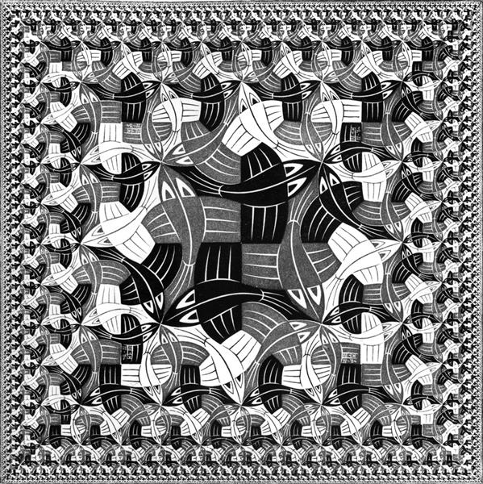

---

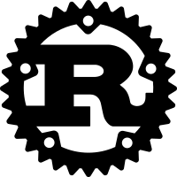

---

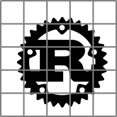

---


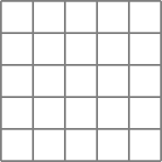

---


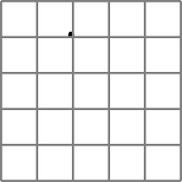

---


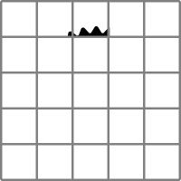

---


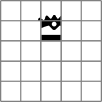

---


---


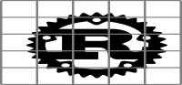

---


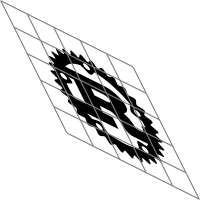

---


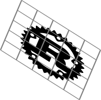

---

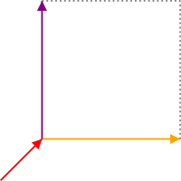

--

```rust
/// A Box represents the area and position that we will draw in.
#[derive(Debug, PartialEq, Clone, Copy)]
pub struct Box {
    /// Determines the origin of the drawing area, used to position the box.
    pub a: Vector<f64>,
    /// Determines the x axis of the box.
    pub b: Vector<f64>,
    /// Determines the y axis of the box.
    pub c: Vector<f64>,
}
```

---

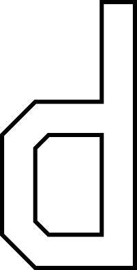

---

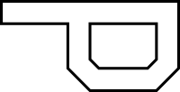

---


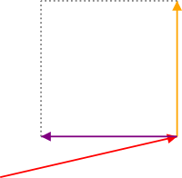

--

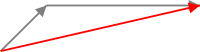

---

```rust
pub fn turn_box(bx: &Box) -> Box {
    Box::new(
        bx.a.add(&bx.b),
        bx.c,
        bx.b.neg()
    )
}
```

---

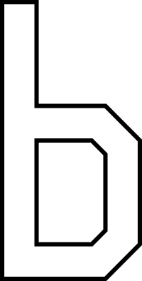

---


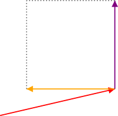

---

```rust
pub fn flip_box(bx: &Box) -> Box {
    Box::new(
        bx.a.add(&bx.b),
        bx.b.neg(),
        bx.c)
    )
}
```

---

```rust
pub fn flip<Picture>(p: Rc<Picture>)
    -> Rc<impl Fn(&Bx) -> Rendering>
where
    Picture: Fn(&Bx) -> Rendering,
{
    Rc::new(move |bx: &Bx| {
        let flipped_box = flip_box(bx);
        p(&flipped_box)
    })
}
```

---

```rust
pub fn flip<Picture>(picture: Rc<Picture>)
    -> Rc<impl Fn(&Bx) -> Rendering>
where Picture: Fn(&Bx) -> Rendering
```

--

```rust
pub type Rendering = Vec<(Shape, Style)>;
```
---

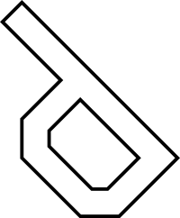

---


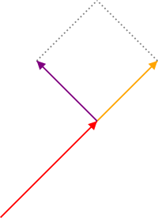

---

```rust
pub fn toss_box(bx: &Box) -> Box {
    Box::new(
        bx.a.add(&bx.b.add(&bx.c).scale(&0.5)),
        bx.b.add(&bx.c).scale(&0.5),
        bx.c.sub(&bx.b).scale(&0.5),
    )
}
```

---

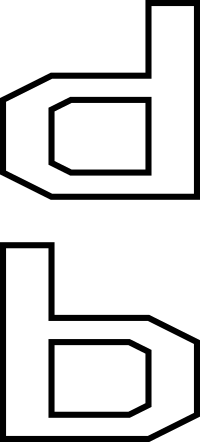

---


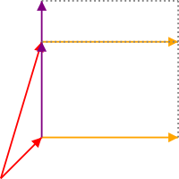

---

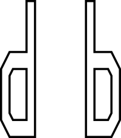

---


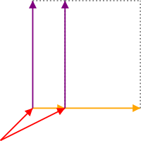

---

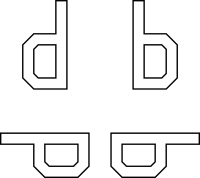

---

```rust
pub fn quartet<P, Q, R, S>(
    nw: Rc<P>,
    ne: Rc<Q>,
    sw: Rc<R>,
    se: Rc<S>,
) -> Rc<impl Fn(&Bx) -> Rendering>
where
    P: Fn(&Bx) -> Rendering,
    Q: Fn(&Bx) -> Rendering,
    R: Fn(&Bx) -> Rendering,
    S: Fn(&Bx) -> Rendering,
{
    above(
        beside(nw, ne),
        beside(sw, se)
    )
}
```

---

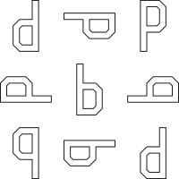

---

```rust
column(
    row(nw, nm, ne),
    row(mw, mm, me),
    row(sw, sm, se)
)
```

--

```rust
/// column
above_ratio(n, above(m, s), 1, 2)
```

``` rust
/// row
beside_ratio(w, beside(m, e), 1, 2)
```


---

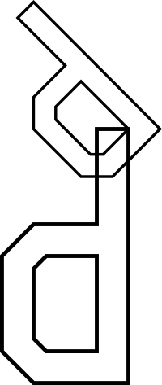

---

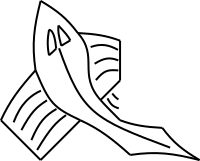

---


---

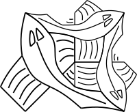

---

```rust
let big = p.clone();
let top = flip(toss(p));
let right = turn(turn(turn(top.clone())));
over(big, over(top, right))
```

---

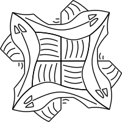

---

```rust
let top = flip(toss(p));
let upper_left = over(top.clone(), turn(top));
over(upper_left.clone(), turn(turn(upper_left)))

```

---

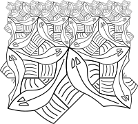

---

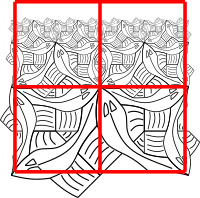

---

```rust
Rc::new(move |bx: &Bx| {
    if n == 0 {
        let q = blank();
        q(bx)
    } else {
        let recurse = side(p.clone(), n - 1);
        let se = ttile(p.clone());
        let sw = turn(se.clone());
        let q = quartet(recurse.clone(), recurse, sw, se);
        q(bx)
    }
})
```

---

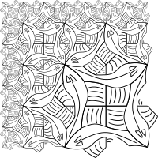

---

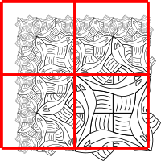

---

```rust
Rc::new(move |bx: &Bx| {
    if n == 0 {
        let q = blank();
        q(bx)
    } else {
        let nw = corner(p.clone(), n - 1);
        let ne = side(p.clone(), n - 1);
        let sw = turn(ne.clone());
        let se = utile(p.clone());
        let q = quartet(nw, ne, sw, se);
        q(bx)
    }
})
```

---

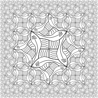

---

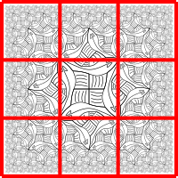

---

```rust
Rc::new(move |bx: &Bx| {
    if n == 0 {
        let q = blank();
        q(bx)
    } else {
        let mm = utile(p.clone());

        let nm = side(p.clone(), n);
        let mw = turn(nm.clone());
        let sm = turn(mw.clone());
        let me = turn(sm.clone());

        let nw = corner(p.clone(), n);
        let sw = turn(nw.clone());
        let se = turn(sw.clone());
        let ne = turn(se.clone());

        let q = nonet(nw, nm, ne, mw, mm, me, sw, sm, se);
        q(bx)
    }
})
```
---

# Functional Geometry

---

