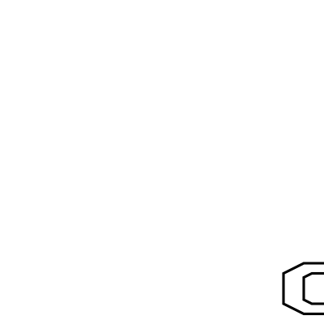

# Above

The transformation that we are tackling next is to place one picture above an
other. although in our example both pictures evenly divide the box between them,
we are going to create a more versatile primitive and than use it to create the
`above` function.

  
  

We are going to create a `split_box_horizontally` that takes a factor and a box
and splits the box in two. So it return a pair of boxes. The factor determines
how much the top box gets to occupy of the original box. The bottom box then
will occupy `1.0 - factor`.

## Implement
Head over to `src/canvas/mod.rs` and implement `split_box_horizontally`. It
helped my to introduce helper functions `scale_box_horizontally` and
`move_box_horizontally`.

With this primitive open `src/picture/mod.rs` and define function `above_ratio`.
This function accepts two pictures and two non-negative integers `m` and `n`. These integers are
used to calculate how much of the pictures get to occupy of the original box.
I.e. the top picture should occupy \\(\frac{m}{m+n}\\) of the original box.

Go on and define `above` in terms of `above_ratio`. Then use it in
`geometry.rs`. For above we need to provide two pictures. Remember that we can
clone a picture to use it more than once. Find the correct combination of
primitives to recreate the picture at the start of this chapter.

