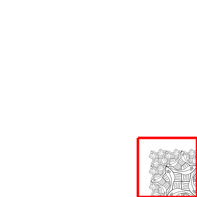

# corner

We have just created a recursive side so the recursion is strong in us. The
corner in her turn is recursive as well. Lets focus our eye on some of the
details.

In the bottom right corner a utile can be recognized. The top right is our
friend side. The bottom left is also a side, but now turned and the recursion
starts in the top left, where we find our own corner but of a lesser order.

## Implementation
Go on young artist, Eschers Square limit is awaiting us.
