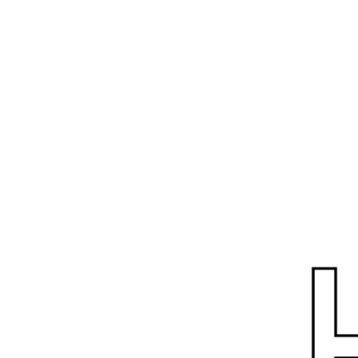

# Flip


Now our new goal is to flip our letter. Just as for the turned picture, we are
going to do this by flipping the box. For the next few chapters this will be our
goal; finding a target box.

Again, we see our goal box on the right, and the reference box on the left. Let's
figure out the relations between the new box fields `a`, `b` and `c` and the
reference box fields `a`, `b`, `c`.

<div class="reference">
  
  
</div>

Notice that for the target box the `a` field is again the sum of the original box `a`
and `b` field.


The new `b` is the original `b` negated and the new `c` is the original `c`.

## Implement
Open `src/canvas/mod.rs` and find the `flip_box` function. Just like the
`turn_box` function before, it is implemented by calling the identity function
on its argument

```
identity(&bx)
```

We need to change that and return a flipped box. It is very is very similar to
the `turn_box` function, so a good start is to copy that body and change it. 

Testing your function is a little bit more involved now. Early you could run
`geometry` binary. Below you can find the `main` function of the `geometry`
binary.  

```rust
let bx = Bx::new(
    Vector::new(0f64, 0f64),
    Vector::new(400f64, 0f64),
    Vector::new(0f64, 400f64)
);
let shapes = letter::d();
let source = create_picture(shapes);
let picture = turn(source);
let document = to_svg((400f64, 400f64), &picture(&bx));
svg::save("output.svg", &document).unwrap();
```

The line to look out for is the `let picture` line. Here we call the function
`turn` on our source shape. This function is found in the `picture` module. The
`turn` function is reproduced here.

```rust
pub fn turn<Picture>(picture: Rc<Picture>) -> Rc<impl Fn(&Bx) -> Rendering>
where Picture: Fn(&Bx) -> Rendering{
    let p = picture.clone();
    Rc::new(move |bx: &Bx| {
        let turned_box = turn_box(&bx);
        p(&turned_box)
    })
}
```

Whoah, look at that signature! It is wild! Take a deep breath, we will look will
explain the signature in a moment. The important parts, the part that turns the
picture is nicely tucked away.

```rust
let turned_box = turn_box(&bx);
p(&turned_box)
```

Here we recognize our `turn_box` function, returning a `turned_box` which is
passed as an argument to what ever `p` is.

There is a lot going on besides that in the turn picture, but a lot of it is
boilerplate. We will explain that shortly. For now just copy the body of the
`turn` function, replace the body of the `flip` function with the copy and alter
it to use your `flip_box` function instead.

This takes care of the `flip` function, but it still needs to be called. Open
the `geometry` binary and change the `let picture` to call `flip` instead of
`turn` on the source.

If every thing worked out just fine, you should be able to run `geomtry` with
the following command

```shell
cargo run --bin geometry
```

and find a flipped letter d in `output.svg`.
