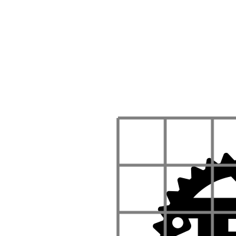
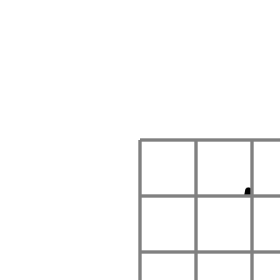
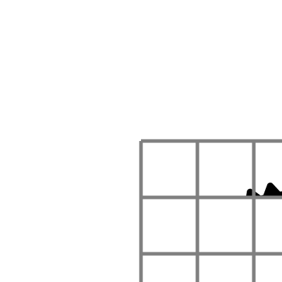
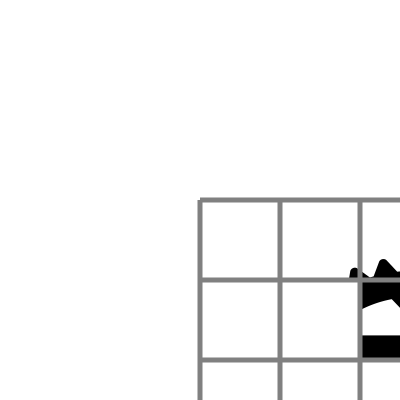

# Grid method
During the workshop we will be relying on a technique well know to painters. It
is called the [_grid method_](https://www.art-is-fun.com/grid-method).

Let's explain this method with our t**Rust**ed logo.

The first thing we do to our logo is overlay a grid.

Next we draw a second grid, similar to the first.

  
  

Now we focus on a single cell in the original grid, and accurately copy it in
the corresponding grid in the target grid. Going from top to bottom and from
left to right, our first cell is empty. The second cell has a single tooth of
the gear. Let's copy it over.

  
  

The following cell has some more teeth.

  
  

By copying each cell one by one, the original logo is recreated.

  
  

