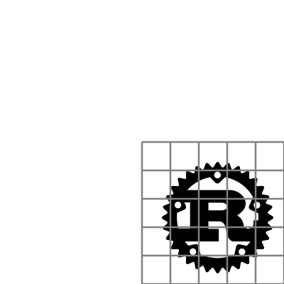

# Grid method
During the workshop we will be relying on a technique well know to painters. It
is called the [_grid method_](https://www.art-is-fun.com/grid-method).

Let's explain this method with our t**Rust**ed logo.

The first thing we do to our logo is overlay a grid.

Next we draw a second grid, similar to the first.

  
  

Now we focus on a single cell in the original grid, and accurately copy it in
the corresponding grid in the target grid. Going from top to bottom and from
left to right, our first cell is empty. The second cell has a single tooth of
the gear. Let's copy it over.

  
  

The following cell has some more teeth.

  
  

By copying each cell one by one, the original logo is recreated.

  
  

until the original is completely copied.

  
  

## Variations
Once we understand the basics of the grid method, we can start to look for
variations. Nobody is restricting you to draw the target grid differently.

### Scale
We could scale the grid.

  
  

### Non-uniform scale
We could scale the grid non-uniformly.

  
  

### Shearing
We could shear the grid.

  
  

### Combination
Or we could combine various transformation and apply that to the grid.

  
  

Because we will make extensive use of the grid method, and want to easily
manipulate the grid, we will introduce an _box_ abstraction.

