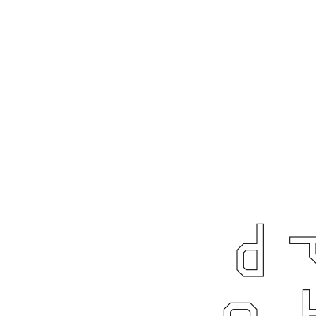

# nonet

What four is to quartet, nine is to nonet. This time we will arrange nine
pictures in a nice grid. Again, this can be achieved with the primitives we
defined our selves.

Analyze the image and dream up a way to build it.

## Implementation
If you don't like spoilers do not read any further. I am going to tell you how I
approached the problem. I introduced to intermediate picture primitives, a
column and a row. A column stacks three pictures atop each other, and row does
the same, but puts them side by side. With these primitives nonet is defined
with a few lines of code.

If you have defined the nonet, go ahead and appreciate your hard work. Use it in
the `geometry` binary and enjoy the marvelous nonet.
