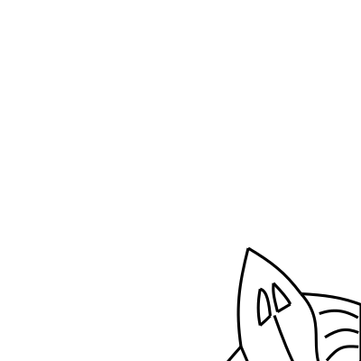

# Drawing an Owl


On the internet there is an image that explains how to draw an owl.


With the possibility of stating something similar I will give you the `fish`
shape as a black box. I can imagine that you feel a bit disappointed. In my
defense you should take a look at the definition of the fish. 

## Implementation
You can use the fish by using the right module.

```rust
use eschers::shape::letter;
```

and calling the appropriate function, which is aptly named `fish`.

```rust
let shapes = escher::fish();
```

With our fishing rod in hand and our picture primitives under our belt, we are
ready to scale mount Escher. We will do that be defining some tiles and
stitching them together in our final image.
