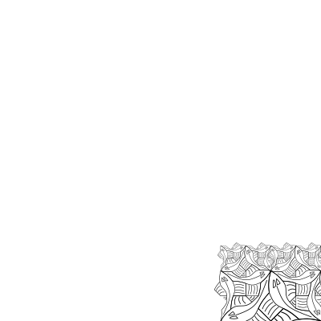
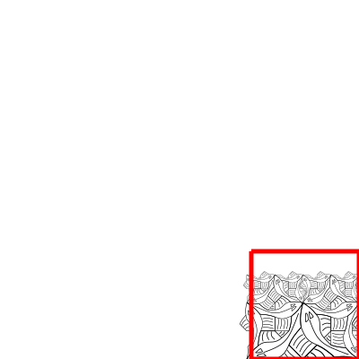

# side

Beautiful. What you are looking at it the _order 3_ side of fish. Escher Square
Limit obviously is a finite picture, there are only so many fish one can draw.
But it clearly hints at the image it wants to be. The infinite arrangement of
fish we are working on to recreate.

One way to do that is with recursion. It can be hard to literally see how, so I
will draw your attention to some of the finer details.

At the bottom squares you could recognize the ttile of fish we created moments
ago. And in the bottom squares. Wait a minute, that is our side that we are
creating, only with one level less.

## Implementation
Find the appropriate primitives and connect them in the right way to create a
recursive side.

