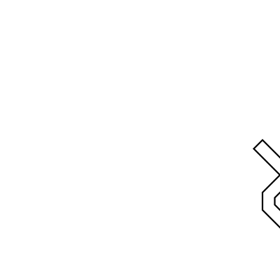
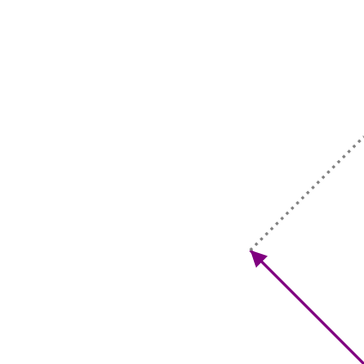

# Toss

With the information about `Picture` in our mind, we toss ourselves on our new
goal. We want to toss our letter d in the air. By now our method of operation is
familiar. Define a tossed box and use it to define our `toss` function.

  
  

Look at the reference box and the tossed box. Whoops it draws outside of the
boundary! Is that even allowed?

Let's try to figure out the vectors for our tossed box. The new `a` vector is right
between the the original `b` and `c` vectors. I.e. \\(a' = a+\frac{b + c}{2}\\).

the new `b` vector is halve as large as the vector addition of `b` + `c`. I.e.
\\(b' = \frac{b + c}{2}\\).

The new `c` is halve as large as the vector from `b` that reaches `c`. I.e.
\\(c' = \frac{c - b}{2}\\).

## Implement
Having found the relations between the original box defining vectors and the
tossed box its defining vector, we can proceed to implement it.

Again in `src/canvas/mod.rs` you find a default implementation of `tossed_box`.
Adopt it to reflect an actual tossed box.

Then find the `toss` function in `src/picture/mod.rs` and use the freshly
defined `tossed_box` function in its body.

Next don't forget to change `geometry` binary to use the new `toss` function,
execute it and marvel at the tossed letter d in `output.svg`.

