# Turn


Our goal is to turn our letter through ninety degrees. As explained in the
background chapter we are going to do this by rotating the box. This way the
picture will be drawn turned automatically.

Here we see our goal box on the right, and the reference box on the left. Let's
figure out the relations between the new box fields `a`, `b` and `c` and the
reference box fields `a`, `b`, `c`.

<div class="reference">
  
  
</div>

Notice that for the target box the `a` field is the sum of the original box `a`
and `b` field.



The new `b` is the original `c` and the new `c` is the original `b` negated.

## Implement
Open `src/canvas/mod.rs` and find the `turn_box` function. At the moment it is
implemented by calling the identity function on its argument

```
identity(&bx)
```

We need to change that and return a turned box. `Box` has a constructor called
`new`. When provided with three `Vector` arguments it will a create a box with
the corresponding fields.

Take a look at the documentation for [`Vector`](doc/eschers/index.html) in order
to figure out how to do vector addition and vector negation. 

Having done that, try to implement the `turn_box` function correctly. You can
test your function by running `geometry` binary.

```shell
cargo run --bin geometry
```

This should produce an `output.svg` and if you implemented `turn_box` correctly
should show the letter d turned.
