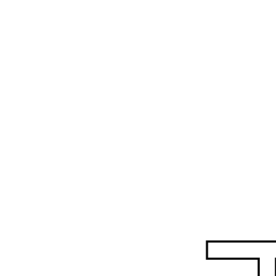
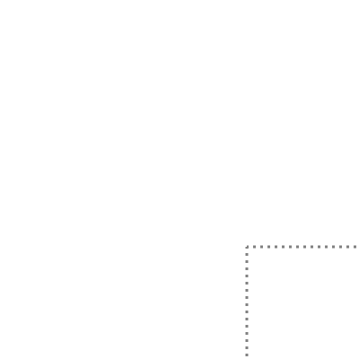

# Turn

Our goal is to turn our letter through ninety degrees. As explained in the
background chapter we are going to do this by rotating the box. This way the
picture will be drawn turned automatically.

Here we see our goal box on the left.

